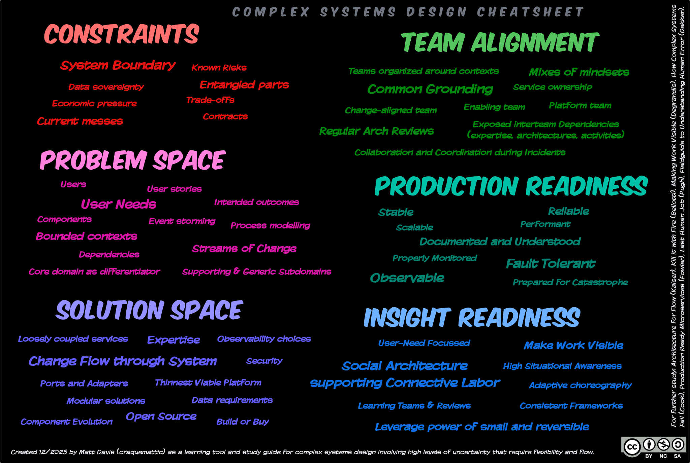

## Complex Systems Design 

Created to help me think about the qualities of design for complex systems. **Download**: [PNG](./Davis-ComplexSystemsDesignCheatsheet.png) / [SVG](./Davis-ComplexSystemsDesignCheatsheet.svg)

> **Created 12/2025 by Matt Davis (craquemattic) as a learning tool and study guide for complex systems design involving high levels of uncertainty that require flexibility and flow.**

> **For further study: Architecture for Flow (Kaiser), Kill it with Fire (Bellotti), Making Work Visible (Degrandis), How Complex Systems Fail (Cook), Production Ready Microservices (Fowler), Last Human Job (Pugh), Fieldguide to Understanding Human Error (Dekker).**

